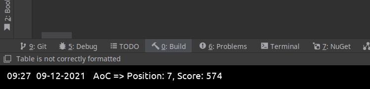

# Advent Of Code 2021

## Polybar script

I have created a simple [`jq`](https://stedolan.github.io/jq/) [script](./polybar/adventofcode_polybar.sh) to show my position on a local leaderboard on my [polybar](https://github.com/polybar/polybar):

## Solutions

| Day | Solutions                                                                                                                                                                                                          | 
|-----|--------------------------------------------------------------------------------------------------------------------------------------------------------------------------------------------------------------------|
| 1   | [F#](https://github.com/jacobduijzer/AdventOfCode2021/blob/main/fsharp/AdventOfCode/Puzzles/Day01.fs) - [Bash](https://github.com/jacobduijzer/AdventOfCode2021/tree/main/bash/day01)                              |
| 2   | [F#](https://github.com/jacobduijzer/AdventOfCode2021/blob/main/fsharp/AdventOfCode/Puzzles/Day02.fs)                                                                                                              |
| 3   | Created on a different computer, forgot to check in. Need to look for it                                                                                                                                           |
| 4   | [C#](https://github.com/jacobduijzer/AdventOfCode2021/blob/main/csharp/AdventOfCode.Core/Puzzles/Day04.cs) - [F#](https://github.com/jacobduijzer/AdventOfCode2021/blob/main/fsharp/AdventOfCode/Puzzles/Day04.fs) |
| 5   | [C#](https://github.com/jacobduijzer/AdventOfCode2021/blob/main/csharp/AdventOfCode.Core/Puzzles/Day05.cs)                                                                                                         |
| 6   | [C#](https://github.com/jacobduijzer/AdventOfCode2021/blob/main/csharp/AdventOfCode.Core/Puzzles/Day06.cs)                                                                                                         |
| 7   | [C#](https://github.com/jacobduijzer/AdventOfCode2021/blob/main/csharp/AdventOfCode.Core/Puzzles/Day07.cs) - [F#](https://github.com/jacobduijzer/AdventOfCode2021/blob/main/fsharp/AdventOfCode/Puzzles/Day07.fs) |
| 8   | [C#](https://github.com/jacobduijzer/AdventOfCode2021/blob/main/csharp/AdventOfCode.Core/Puzzles/Day08.cs)                                                                                                         |
| 9   | [C#](https://github.com/jacobduijzer/AdventOfCode2021/blob/main/csharp/AdventOfCode.Core/Puzzles/Day09.cs)                                                                                                         |
|     |                                                                                                                                                                                                                    |